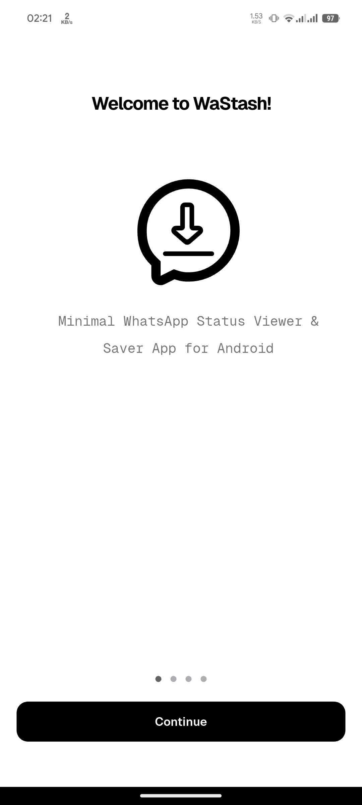
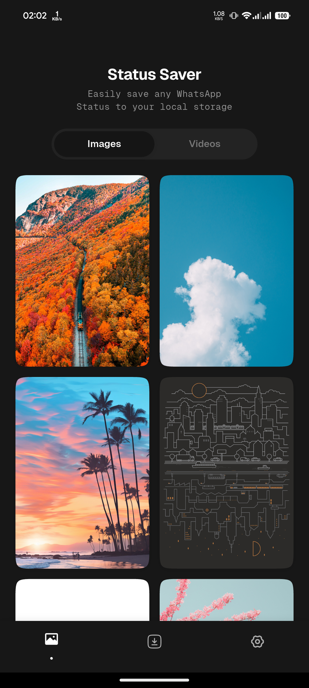
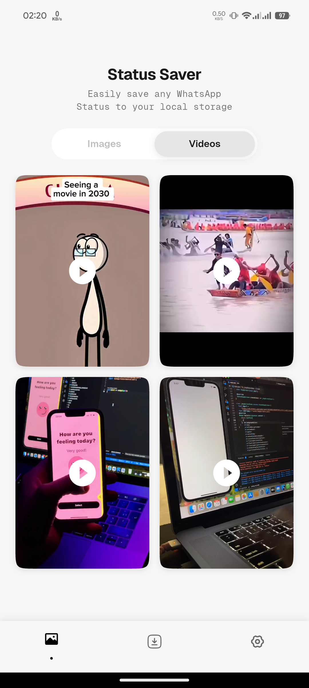
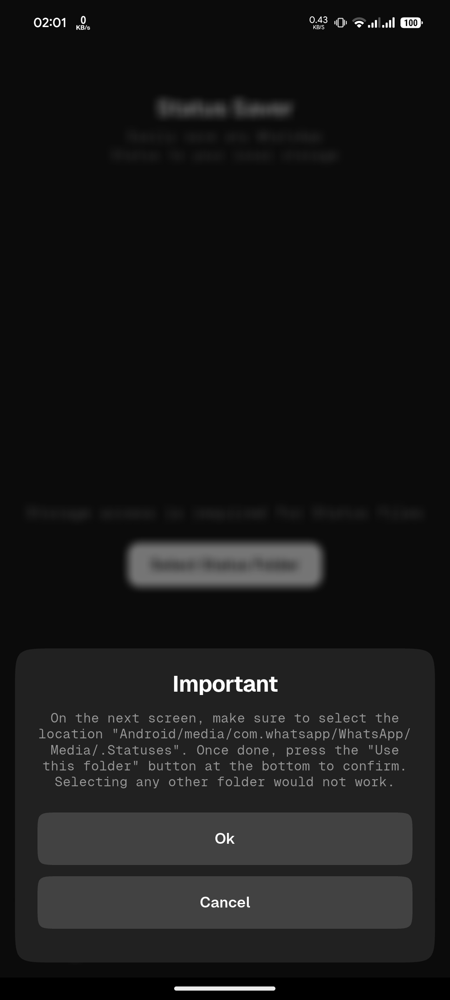
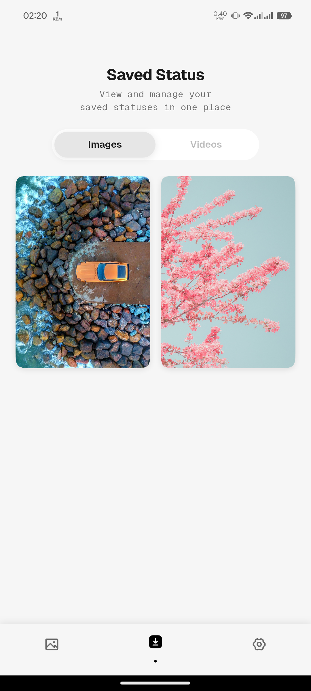
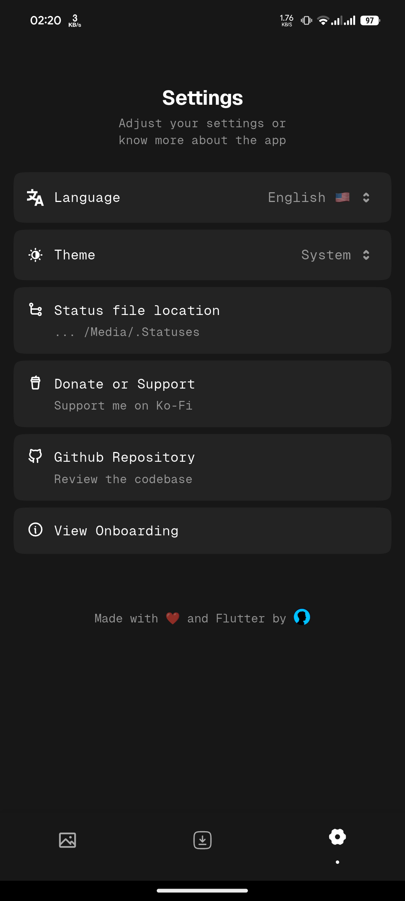
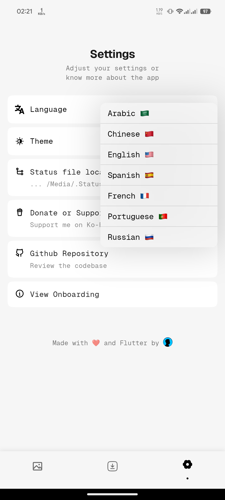

# 📲 WaStash - The Ultimate WhatsApp Status Saver App

WaStash is a lightweight, fast, and user-friendly WhatsApp Status Saver app built using Flutter. It allows users to save images and videos from WhatsApp statuses with just one tap — no screenshots, no screen recordings.


## ✨ Features

- 📷 View and Save WhatsApp status photos & videos
- ⚡ One-tap save to your device
- 📁 Organized saved media (images/videos separated)
- 🔄 Repost or share statuses directly from the app
- 🧼 Clean and modern UI
- 🔐 Fully offline – no login or data collection
- 🌗 Supports light and dark themes
- 🌍 Multiple languages

## 📸 Screenshots

| **OnBoarding**                                       | **Status Images**                           | **Status Videos**                                 | **Important instructions**                                   |
| ---------------------------------------------------- | ------------------------------------------- | ------------------------------------------------- | ------------------------------------------------------------ |
|  |  |  |  |

| **Status Preview**                           | **Saved Status**                                  | **Settings**                                 | **Languages**                                      |
| -------------------------------------------- | ------------------------------------------------- | -------------------------------------------- | -------------------------------------------------- |
|  |  |  |  |

## 🚀 Getting Started

### ✅ Prerequisites

- Flutter SDK [official Flutter website](https://flutter.dev/docs/get-started/install).

### 🧪 Run Locally

1. Clone the repository:

   ```bash
   git clone https://github.com/MrMDrX/WaStash.git
   ```

2. Navigate into the project directory:

   ```bash
   cd WaStash
   ```

3. Install the dependencies:

   ```bash
   flutter pub get
   ```

4. Run the application:

   ```bash
   flutter run
   ```

## 🤝 Contributing

We welcome contributions! If you have suggestions or improvements, please open an issue or submit a pull request.

## 📄 License

This project is licensed under the MIT License - see the [LICENSE](LICENSE.md) file for detail

## 🙋‍♂️ About

Developed with ❤️ using Flutter.
Maintained by [Med](https://github.com/mrmdrx)
